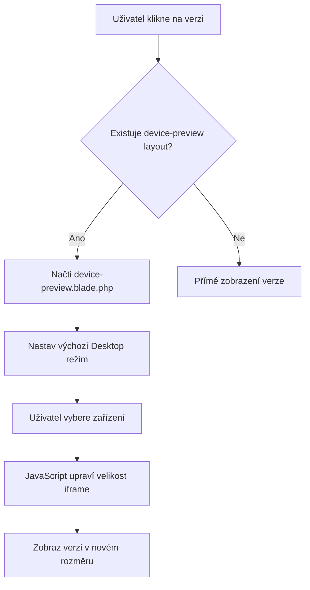

# Architektura Device Previewer Wrapper

## Přehled
Vytvoření obalovací šablony (wrapper), která umožní prohlížení verzí aplikace v různých responzivních režimech (Desktop, Tablet, Mobile).

## Navrhované řešení: Iframe-based Device Previewer

### 1. Struktura souborů

```
resources/
├── layouts/
│   └── device-preview.blade.php    # Hlavní layout s device switcher
├── views/
    └── versions/
        └── v1/
            └── index.blade.php      # Verze aplikace (bez obalu)
```

### 2. Komponenty

#### A. Device Previewer Layout (`device-preview.blade.php`)
- **Horní lišta (Fixed Top Bar)**:
  - Logo/Název verze
  - Device switcher tlačítka: Desktop | Tablet | Mobile
  - Tlačítko pro zpět na rozcestník
  - Možnost URL pro přímý přístup k verzi (bez wrapperu)

- **Hlavní kontejner**:
  - Centrovaný iframe s verzí aplikace
  - Dynamická šířka/výška podle vybraného zařízení

#### B. Device Presets

| Zařízení | Šířka | Výška | Orientace |
|----------|-------|-------|------------|
| Desktop  | 100%  | 100%  | Landscape  |
| Tablet   | 1024px| 768px | Landscape  |
| Mobile   | 375px | 812px | Portrait   |

### 3. Technologie

- **HTML/CSS**: Stylování wrapperu a device kontejneru
- **JavaScript**: Přepínání mezi zařízeními, úprava velikosti iframe
- **Laravel Blade**: Layout a dynamické načítání verzí

### 4. Flow aplikace



### 5. Implementační kroky

1. **Vytvoření layoutu**:
   - Vytvořit `resources/layouts/device-preview.blade.php`
   - Implementovat horní lištu s device switcher
   - Přidat kontejner pro iframe

2. **Úprava verzí**:
   - Verze aplikace by měly fungovat samostatně (bez wrapperu)
   - Wrapper je volitelný - lze přistupit přímo k verzi

3. **JavaScript logika**:
   - Funkce pro přepínání zařízení
   - Uložení vybraného zařízení do localStorage
   - Automatická úprava velikosti iframe

4. **Routy**:
   - Upravit existující catch-all routu pro podporu wrapperu
   - Možnost přepínače v URL: `?device=tablet` nebo `?preview=true`

### 6. Výhody řešení

- ✅ Izolace obsahu (iframe zabraňuje konfliktům CSS/JS)
- ✅ Snadná implementace
- ✅ Verze fungují i bez wrapperu
- ✅ Možnost přímého přístupu k verzi
- ✅ Flexibilní přidávání nových device presetů

### 7. Alternativní řešení (CSS Container)

Pokud iframe řešení nebude vyhovovat, alternativou je CSS transform řešení:
- Obsah zabalit do kontejneru s fixními rozměry
- Použít CSS `transform: scale()` pro zmenšení
- Výhody: Bez iframe, lepší interakce
- Nevýhody: Složitější implementace, potenciální problémy se scrollováním

## Doporučení

Pro začátek doporučuji **iframe řešení** kvůli jeho jednoduchosti a spolehlivosti. Pokud bude potřeba pokročilejší interakce, lze později přejít na CSS container řešení.